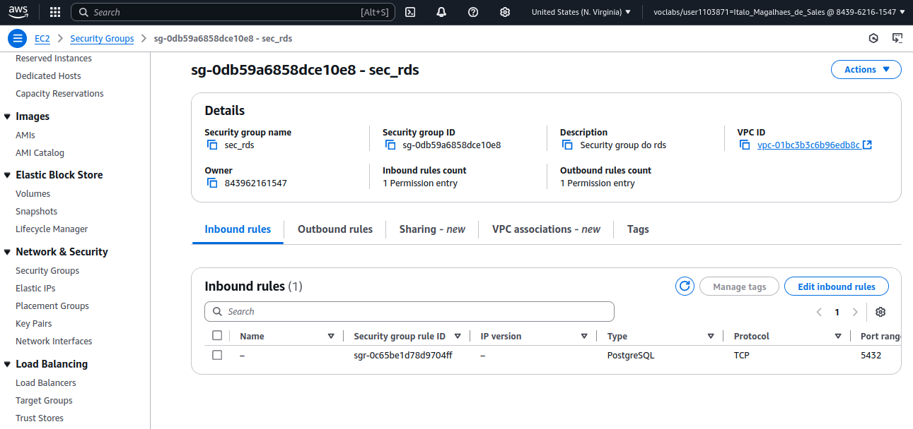

# Configuração de Infraestrutura AWS (EC2, RDS e Security Groups)

Nome: Ítalo Magalhães de Sales

Este documento descreve os passos realizados para configurar uma instância EC2, um banco de dados RDS e os Security Groups necessários para a comunicação entre os serviços.

## 1. Configuração dos security groups

1. Criar security group do EC2:
   
2. Criar security group do RDS:
   

## 2. Criação da instancia do EC2

## 3. Criação da instancia do RDS com postgreSQL

